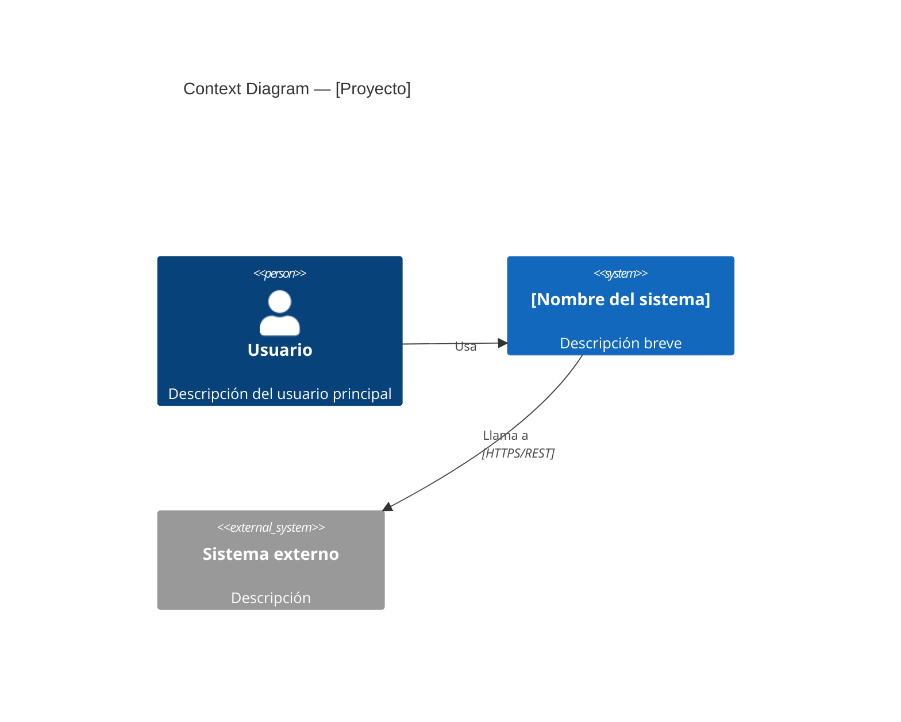
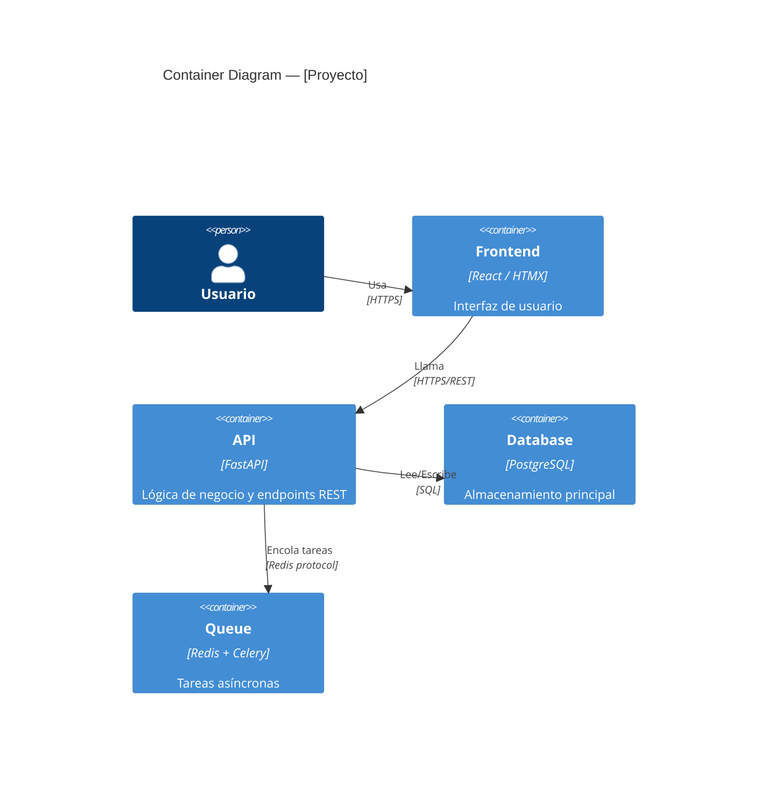

# Architecture — [Nombre del Proyecto]

> Documento vivo. Actualizar al cerrar cada sprint o cuando cambie la arquitectura.  
> Última actualización: YYYY-MM-DD

---

## 1. Visión general

[2-3 párrafos describiendo qué hace el sistema, para quién, y cuál es su propósito de negocio.]

---

## 2. Stack tecnológico

| Capa | Tecnología | Versión | Notas |
|------|-----------|---------|-------|
| Backend | FastAPI | x.x | ... |
| ORM | SQLAlchemy | 2.x | Async |
| Base de datos | PostgreSQL | 15 | ... |
| Frontend | React / HTMX | ... | ... |
| Auth | JWT / OAuth2 | — | ... |
| Queue | Celery + Redis | — | Opcional |
| CI/CD | GitHub Actions | — | ... |
| Deploy | Docker / Railway / ... | — | ... |

---

## 3. Diagrama de contexto (C4 — Level 1)



---

## 4. Diagrama de contenedores (C4 — Level 2)



---

## 5. Estructura del proyecto

```
project/
├── app/
│   ├── core/            # Config, DB, middleware, logging
│   ├── features/        # Un módulo por feature (router, service, repo, schemas)
│   │   └── users/
│   │       ├── router.py
│   │       ├── service.py
│   │       ├── repository.py
│   │       ├── schemas.py
│   │       ├── models.py
│   │       └── exceptions.py
│   └── main.py
├── tests/
│   ├── conftest.py
│   └── features/
│       └── users/
├── alembic/             # Migraciones de DB
├── docker/
├── .github/workflows/
└── pyproject.toml
```

---

## 6. Decisiones de arquitectura (ADRs)

| ADR | Título | Estado |
|-----|--------|--------|
| ADR-001 | [Título] | Accepted |

---

## 7. Consideraciones de seguridad

- Autenticación: [método]
- Autorización: [modelo de permisos]
- Datos sensibles: [cómo se manejan]
- Secretos: [dónde viven, cómo se inyectan]

---

## 8. Consideraciones de despliegue

[Cómo se despliega, variables de entorno requeridas, dependencias externas.]
